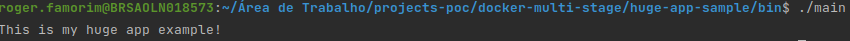
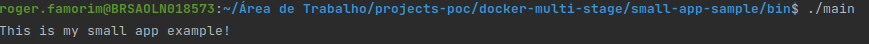

# Docker build stage
Docker build stage comparison

# Docker Build Stage

-   [Docker build multi-stage](#docker-build-multi-stage)
-   [Docker without build multi-stage](#docker-without-build-multi-stage)
-   [Comparison](#comparison)

## Docker build multi-stage

With multi-stage builds, you use multiple FROM statements in your Dockerfile. Each FROM instruction can use a different base, and each of them begins a new stage of the build. You can selectively copy artifacts from one stage to another, leaving behind everything you don’t want in the final image. To show how this works, let’s adapt the Dockerfile from the previous section to use multi-stage builds.

## Docker without build multi-stage

One of the most challenging things about building images is keeping the image size down. Each RUN, COPY, and ADD instruction in the Dockerfile adds a layer to the image, and you need to remember to clean up any artifacts you don’t need before moving on to the next layer. To write a really efficient Dockerfile, you have traditionally needed to employ shell tricks and other logic to keep the layers as small as possible and to ensure that each layer has the artifacts it needs from the previous layer and nothing else.

It was actually very common to have one Dockerfile to use for development (which contained everything needed to build your application), and a slimmed-down one to use for production, which only contained your application and exactly what was needed to run it. This has been referred to as the “builder pattern”. Maintaining two Dockerfiles is not ideal.

## Comparison

Here we will compare the different sizes between a multi-stage docker image and without multi-stage docker image.

Notice the application that are executed is the same!

The same applications in execution:

